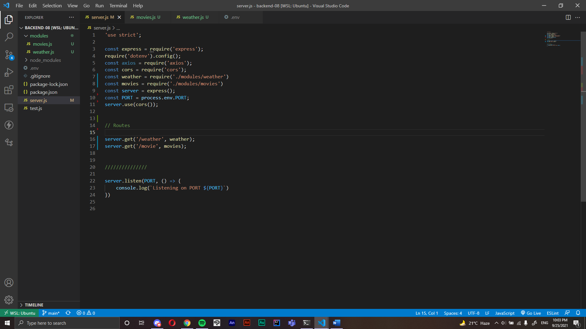

## white box testing:

in this photo we can see the server page which gethers all the pathes for our urls and declearing and declearing an HTTP tag for each and everyone.

 

.png)

i declared a search qurey for the part where the user will use the search bar and it will return information deppending on the city he choose, after that it will return a the information about the movies that we declared in the movies class.

 

.png)

the weather file is pretty semelar to the movies, for it works the same way almost the same method and class, different req though and urls

 

.png)

in this file we can find the .env filewhich we implement our keys in it to not share it when we upload our work to github

 

.png)

 

.png)

 
here we see the front end file along with all the css and forms we made to call the back end functions into the users interface.

